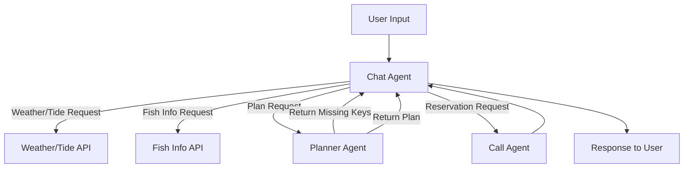

# 🎣 Guryongpo Fishing Chatbot LangGraph Specification

## 1. Overview

This system uses **LangGraph** to implement a fishing planning chatbot for Guryongpo.
The user interacts in natural language, and the chatbot retrieves weather/tide data, fish availability, builds fishing plans, and makes reservation calls.

---

## 2. Main Graphs

### 2.1. Top-Level Graph (FishingPlannerGraph)

* **Role:** Orchestrates the overall conversation and routes to sub-agents.
* **Main Nodes:**

  * **Chat Agent Node**
  * **Planner Agent Node**
  * **Call Agent Node**
  * **Tool Nodes (Weather/Tide API, Fish Info API)**

---

### 2.2. Chat Agent Node

* **Input:** User message, conversation context
* **Output:** Next Action (tool call / agent call / final response)
* **Possible Actions:**

  1. Call Weather/Tide API
  2. Call Fish Info API
  3. Call Planner Agent
  4. Call Call Agent
  5. Respond to user

---

### 2.3. Planner Agent Node

* **Input:** Conversation context + collected variables
* **Plan Model (required variables):**

  * Date
  * Participants (adults, children)
  * Fishing type (boat / pier)
  * Budget
  * Gear availability
  * Transportation method
  * (Optional) Target fish species
* **Output:**

  1. **Missing keys** (e.g., `["budget", "gear"]`)
  2. **Completed fishing plan** (if all keys are satisfied)

---

### 2.4. Call Agent Node

* **Input:** Current fishing plan, selected fishing shop
* **Internal Logic:** Uses Twilio API to place a phone call
* **Output:** Call result summary (reservation status, price, conditions, failure info)

---

### 2.5. Tool Nodes

1. **Weather/Tide API Node**

   * Input: Date range, location (Guryongpo)
   * Output: Weather/tide data
2. **Fish Info API Node**

   * Input: Location (Guryongpo), date (today)
   * Output: Current available fish species and counts

---

## 3. Graph Flow

---

## 4. State Management

* Conversation context is maintained in a **Memory Store**.
* Planner Agent maintains a **Plan Model state**:

  * Stores collected variables
  * Updates missing key list

---

## 5. Example Workflow

1. **User:** “Tell me the best fishing days in Guryongpo during Chuseok holidays.”

   * Chat Agent → Weather/Tide API
   * Chat Agent → “From Oct 10–12, the best fishing day is Oct 11.”

2. **User:** “Okay, let’s go on Oct 11. What fish are being caught now?”

   * Chat Agent → Fish Info API
   * Chat Agent → “Today, mackerel (20) and squid (10) are most common.”

3. **User:** “Make a fishing plan for that day.”

   * Chat Agent → Planner Agent
   * Planner Agent → Missing keys: `["participants", "budget"]`
   * Chat Agent → “Please provide participant count and budget.”

4. **User:** “2 adults, 1 child, budget 200,000 KRW.”

   * Planner Agent → All keys satisfied, returns plan
   * Chat Agent → “Here’s a suitable plan. Recommended fishing shops: A, B, C. Do you want to call one of them?”

5. **User:** “Make the call.”

   * Chat Agent → Call Agent
   * Call Agent → Twilio call → returns result
   * Chat Agent → “Reservation confirmed. Here’s your final plan: …”

---

## 6. Implementation Checklist

* [ ] Implement Chat Agent routing logic
* [ ] Wrap Weather/Tide API
* [ ] Wrap Fish Info API
* [ ] Define Plan Model (Pydantic or schema)
* [ ] Implement Planner Agent logic
* [ ] Implement Call Agent with Twilio
* [ ] Manage state with LangGraph (context + plan state)
* [ ] Test graph execution end-to-end
